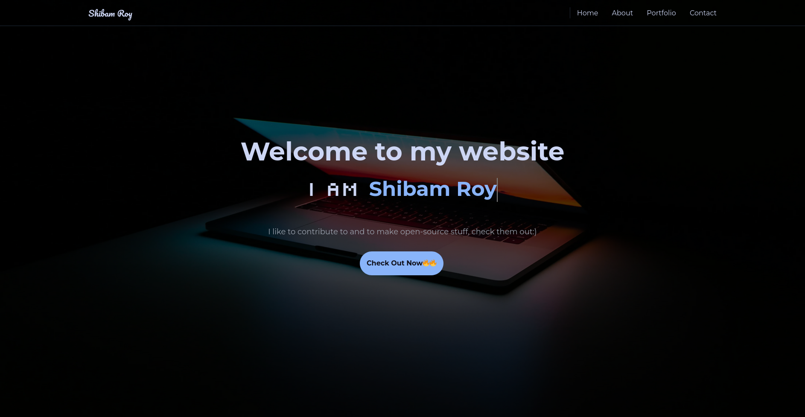
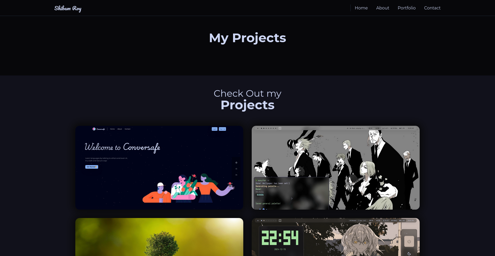
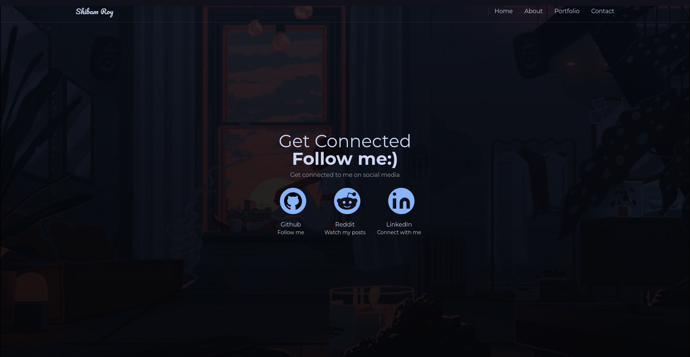

# My Portfolio 💼

This repository contains my portfolio, its basically a static website hosted with [github pages](https://pages.github.com/) and made with vanilla HTML,CSS ,JavaScript, and Tailwind CSS.
Its live [here](https://shibamroy9826.github.io/).
This contains information about my skills(including my experience with them), my projects, about myself, and my certifications.
I would highly recommend checking it out, but if you are feeling lazy, I have attached some screenshots below

## Screenshots 📷

> [!NOTE]
> All pages aren't included in screenshots(Infact most of it isn't), because I have to prepare for exams... I will update it soon...

## Projects 🛠️ 

These are all the "proper" projects that I made, there are a few others too, but I would rather not like to showcase them now... They are pretty bad compared to these, I will update them here after I finish recreating them!

- [Conversafe](https://github.com/ShibamRoy9826/Conversafe) 
- [EasyFeh](https://github.com/ShibamRoy9826/easyfeh)
- [EcoSight](https://github.com/ShibamRoy9826/EcoSight-Geek-a-thon-project)
- [QT_Tile](https://github.com/ShibamRoy9826/qt_tile)
- [Remime](https://ecosight.pythonanywhere.com/)
- [SantaPlace](https://github.com/ShibamRoy9826/SantaPlace)
- [SubSeaSignal](https://github.com/ShibamRoy9826/SubSeaSignal)
- [Remime-web-lite](https://github.com/ShibamRoy9826/remime-web-lite)
  
## A Quote 💡

## My Tech Stack 💻

## My Stats 🏆

    &nbsp;&nbsp;
    &nbsp;&nbsp;

## When I'm AFK 🎮

 &nbsp;
 &nbsp;
 &nbsp;
